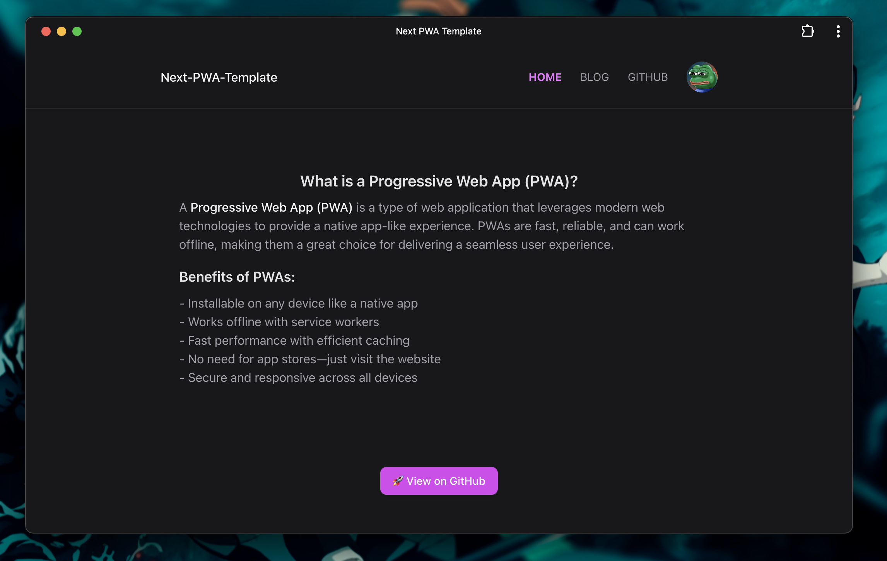

	
	<h2 align="center">Next PWA Gh-Page Template</h2>

Template for PWA using Next.js and next-pwa package

	<a href="https://maniadav.github.io/next-pwa-github-template">Live demo</a>

## Get Started

- update `basePath` in config.ts to your github repo name as github expect asset from your repo...
- update `basePath=""` if working in dev mode
- also update `isGithubDeploy` to false for dev mode and `repoName` to your github repo

**Also Checkout**

- [next-workbox-pwa](https://github.com/maniadav/next-workbox-pwa) for PWA using workbox-build package

### Desktop

Points to keep in mind:

1. // next start doesn't work output export in next-config.js so use npx serve out
